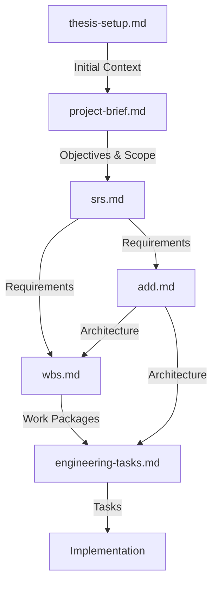

# Documentation Directory

This directory contains all project documentation for the Fuzzy-LLM Hybrid IoT
Management System. These documents provide comprehensive information from
project conception through architectural design and software requirements.

**Authoritative Source:** All documents derive from and implement the thesis
assignment defined in [thesis-setup.md](thesis-setup.md). The core concept is
using fuzzy logic as a **semantic bridge** between sensor values and linguistic
concepts for LLM processing.

## Document Overview

### Project-Planning Documents

#### [project-brief.md](project-brief.md)

**Purpose:** High-level project overview and objectives

Describes the overall project concept, objectives, and expected outcomes.
Contains:

- **Thesis scope alignment** with traceability to thesis requirements
- **Semantic bridge** concept explanation
- Project overview and primary goals
- Thesis MVP scope vs future work distinction
- Detailed technical requirements for each major component
- Success criteria and expected outcomes
- Deliverables specification
- Risk mitigation strategies

**Target Audience:** Project stakeholders, thesis reviewers, developers seeking
project context

______________________________________________________________________

#### [thesis-setup.md](thesis-setup.md)

**Purpose:** Original thesis assignment and research scope

The formal thesis assignment from the University of Sarajevo that defines the
research topic. Contains:

- Assignment description and research objectives
- Significance of the work and expected contributions
- Initial literature references
- Faculty and departmental context

**Target Audience:** Thesis candidate, academic supervisors, examiners

______________________________________________________________________

### Design Documents

#### [add.md](add.md)

**Purpose:** System architecture and design specifications

The Architecture Design Document (ADD) provides complete architectural
specifications for implementation. Contains:

- Layered architecture design (5 layers with coordinators)
- Component descriptions and responsibilities
- Interaction flows between components
- Data architecture and persistence model
- Deployment architecture and directory structure
- Security architecture and validation pipelines
- Performance targets and optimization strategies
- Design decisions with rationale
- Technology stack and API references

**Target Audience:** System architects, implementation developers, technical
reviewers

**Key Content:**

- 5-layer architecture: User Interface → Configuration & Management → Control &
  Reasoning → Data Processing (Semantic Bridge) → Device Interface
- **Thesis MVP vs Future Work** distinction for all components
- Component coordination patterns
- JSON-based configuration schemas
- Resource budget (8GB total footprint)
- Performance targets (end-to-end < 5s, LLM inference < 3s)

______________________________________________________________________

### Engineering Documents

#### [engineering-tasks.md](engineering-tasks.md)

**Purpose:** Chronologically ordered engineering task list for implementation

A comprehensive, implementation-ready task list optimized for autonomous
development units. Contains:

- **Phase-based organization** with clear dependencies
- **Chronological ordering** for bottom-up implementation
- **Task-level granularity** with acceptance criteria
- **Effort estimates** for planning
- **Validation checkpoints** at each phase
- **Integration points** between layers

**Target Audience:** Developers, autonomous coding agents, project managers

**Key Content:**

- 9 implementation phases from foundation to documentation
- 150+ detailed engineering tasks
- SRS requirement traceability for each task
- Performance and coverage targets
- Smart home demo scenario tasks

______________________________________________________________________

### Requirements Documents

#### [srs.md](srs.md)

**Purpose:** Comprehensive software requirements specification

The Software Requirements Specification (SRS) provides detailed functional and
non-functional requirements. Contains:

- 100+ functional requirements organized by component
- Non-functional requirements (performance, reliability, usability, security,
  maintainability, portability)
- System interface specifications
- Data structure definitions
- User interface modes
- Acceptance criteria
- Requirements traceability matrix

**Target Audience:** Developers, QA engineers, project managers, stakeholders

**Key Content:**

- **Thesis prototype scope** with MVP requirements clearly identified
- High-priority requirements for core functionality
- Performance requirements (response time < 5s, LLM latency < 3s)
- Resource constraints (7B max model size, 8GB RAM)
- Privacy and security requirements
- IEEE 830 structure for requirements specification
- **Semantic bridge** definition and integration

______________________________________________________________________

## Document Relationships

**Document Flow:**

1. **thesis-setup.md** - Establishes research topic and scope
2. **project-brief.md** - Expands scope into specific objectives and
   deliverables
3. **srs.md** - Translates objectives into detailed requirements
4. **add.md** - Designs architecture to meet requirements
5. **wbs.md** - Breaks work into packages with dependencies
6. **engineering-tasks.md** - Detailed, ordered task list for implementation
7. **Implementation** - Code built from task specifications

______________________________________________________________________

## Usage Guide

### For Developers

**Starting Implementation:**

1. Read `project-brief.md` for project context
2. Review `srs.md` to understand requirements
3. Study `add.md` for architecture and design details
4. Reference `thesis-setup.md` for research background

**During Development:**

- Use `add.md` component descriptions as implementation guide
- Verify implementation against `srs.md` requirements
- Follow `add.md` directory structure and design patterns

**For Testing:**

- Use `srs.md` acceptance criteria for test planning
- Verify `add.md` performance targets in performance tests

### For Reviewers

**Architecture Review:**

- Focus on `add.md` for design justification
- Review design decisions section (Section 9)
- Verify adherence to layered architecture principles

**Requirements Traceability:**

- Map implementation to `srs.md` requirements
- Verify coverage of high-priority items
- Check against project objectives in `project-brief.md`

### For Thesis Evaluation

**Research Context:**

- `thesis-setup.md` - Authoritative source: original assignment and expectations
- `project-brief.md` - How objectives are addressed, thesis scope alignment
- Literature review section in both documents

**Core Concept Validation:**

- Verify **semantic bridge** implementation (fuzzy logic → linguistic
  descriptions)
- Check alignment with thesis deliverables table in `project-brief.md`
- Confirm MVP features match thesis requirements

**Implementation Evidence:**

- `add.md` - Demonstrates systematic design with MVP/future work distinction
- `srs.md` - Shows requirements engineering process with thesis scope
- Code implementation - Realization of documented design

______________________________________________________________________

## Document Maintenance

### Version Control

All documentation is version-controlled with the codebase. When changes are
made:

1. **Update relevant documents** when major architectural or requirement changes
   occur
2. **Maintain consistency** across documents (e.g., if ADD changes, update SRS
   as needed)
3. **Document changes** in commit messages with appropriate reference

### Update Triggers

**ADD Updates Required When:**

- New components or layers are added
- Communication patterns change
- Design decisions are modified or reversed
- New technologies are adopted

**SRS Updates Required When:**

- New requirements are added
- Requirement priorities change
- Non-functional targets are modified
- Acceptance criteria evolve

**project-brief Updates Required When:**

- Project scope changes significantly
- Success criteria are modified
- Deliverables are added or removed

### Review Process

Before committing significant documentation changes:

1. **Cross-reference** related documents for consistency
2. **Verify** alignment with actual implementation
3. **Update** diagrams if needed
4. **Solicit feedback** from thesis supervisor or project stakeholders

______________________________________________________________________

## Quick Reference

### Key Performance Targets (from ADD and SRS)

- End-to-end response: < 5 seconds
- LLM inference: < 3 seconds
- Fuzzy processing: < 100ms
- System startup: < 30 seconds
- Memory footprint: 8GB total
- System availability: 99% uptime

### Important Constraints

- Python 3.9+ required
- Offline LLM execution via Ollama (no cloud)
- Maximum 7B parameter models
- JSON format for all configuration
- MQTT for device communication (thesis prototype)
- No data transmission to external services

### Thesis MVP Features

- Fuzzy logic semantic bridge with JSON configuration
- Ollama-based LLM inference
- Natural language rule processing
- MQTT device communication
- Command-line interface
- Docker Compose containerization
- Smart home demonstration scenario

### Future Work (Not Required for Thesis)

- Web-based user interface
- REST API interface
- Multi-protocol device support
- Distributed deployment

### Architecture Highlights

- 5-layer strict layered architecture
- Coordinator pattern for inter-layer communication
- Device Interface (bottom) → Data Processing → Control & Reasoning →
  Configuration → User Interface (top)
- Docker Compose for service orchestration
- MQTT for device communication
- Ollama for LLM inference
- JSON for configuration and persistence
- Makefile for development convenience

______________________________________________________________________

## Additional Resources

### External References

Initial literature cited in `thesis-setup.md` provides research background on:

- Synergistic integration of LLMs with fuzzy inference systems
- LLM integration into IoT networks
- Orchestrating AI and IoT with LLMs
- Natural language access control for IoT

### Implementation Support

- Directory structure documented in `add.md` Section 6.2
- README.md files in each code directory explain component purpose
- Test strategy outlined in `tests/` directory README

______________________________________________________________________

## Questions or Issues

For questions about documentation content:

- Refer to specific document sections
- Check document cross-references
- Review implementation README files
- Consult thesis supervisor for academic context

For documentation inconsistencies or errors:

- Report issues in project issue tracker
- Suggest improvements via pull requests
- Maintain alignment between code and documentation
